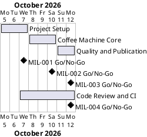

# Project Plan

## Metadata
| Key | Value |
| --- | --- |
| ID | PP-001 |
| CrossReference | [BC-001], [SA-001], [MIL-001], [MIL-002], [MIL-003], [MIL-004] |

## Version History
| Date | Status | Author | Reviewer | Change | Commit |
| --- | --- | --- | --- | --- | --- |
| 2026-10-06 | Deprecated | Jens Tirsvad Nielsen | S01 | Added MIL-004 Code Review and CI | [8ef00aa] |
| 2026-10-06 | Accepted | Jens Tirsvad Nielsen | S01 | Fixed phase count, dependency overlap and stale risks and open issues (RC-009 actions) | [52b9725] |

---

## Purpose

Schedule the four phases that take the coffee machine from empty repository to a
reviewed, published project, within the one-week duration in [BC-001].

## Planning Assumptions

- Week 1 starts 2026-10-05; the plan ends by 2026-10-12.
- Phase length: two to three days; S01 reviews each phase through a pull request (see [SA-001]).
- Each phase is delivered through one or more branches and pull requests.

## Gateway Schedule

| Gateway | Document | Window | Decision date | Owner | Stories | Main deliverable | Milestone |
| --- | --- | --- | --- | --- | --- | --- | --- |
| Project Setup | [MIL-001] | 2026-10-05 to 2026-10-07 | 2026-10-07 | S01 | none | Skeleton, tooling, README | [Milestone 40] |
| Coffee Machine Core | [MIL-002] | 2026-10-08 to 2026-10-10 | 2026-10-10 | S01 | none | Working program | [Milestone 41] |
| Quality and Publication | [MIL-003] | 2026-10-11 to 2026-10-12 | 2026-10-12 | S01 | none | Tests, Doxygen, published repo | [Milestone 42] |
| Code Review and CI | [MIL-004] | 2026-10-07 to 2026-10-12 | 2026-10-12 | S01 | none | Source review record, CI workflow | [Milestone 48] |



## Scope Coverage

| Business Case scope item | Gateway |
| --- | --- |
| Console program with `constants.py` | [MIL-002] |
| pytest tests | [MIL-003] |
| `pyproject.toml`, `.gitignore`, `Doxyfile`, README | [MIL-001] |
| Project documents | Planning, before [MIL-001] |
| Repository description and topics | [MIL-003] |
| Source code review record and CI workflow | [MIL-004] |

## Dependencies

```
MIL-001 -> MIL-002 -> MIL-003 -> MIL-004
```

[MIL-004] may start once the [MIL-003] tests are merged, so their windows overlap; its decision follows the decision of [MIL-003].

A No-Go moves all later dates by the same amount.

## Plan Risks

| Risk | Impact | Mitigation |
| --- | --- | --- |
| The git host has no Actions runner | CI cannot run | Check the host first; if none, keep the workflow file and document the local commands |
| Doxygen not installed locally | Cannot verify docs | Document the install step in README |

## Open Issues

- No use cases or user stories are written; tasks are plain technical tasks implementing the assignment specification. S01 can ask for a use case ("Order a drink") if wanted.

---

[BC-001]: ./business-case.md
[SA-001]: ./stakeholder-analysis.md
[MIL-001]: ./milestones/mil-001-project-setup.md
[MIL-002]: ./milestones/mil-002-coffee-machine-core.md
[MIL-003]: ./milestones/mil-003-quality-and-publication.md
[MIL-004]: ./milestones/mil-004-code-review-and-ci.md
[Milestone 40]: https://git.tirsystem.com/Tirsvad-Udemy-100_days_of_code/015-coffee_machine/milestone/40
[Milestone 41]: https://git.tirsystem.com/Tirsvad-Udemy-100_days_of_code/015-coffee_machine/milestone/41
[Milestone 42]: https://git.tirsystem.com/Tirsvad-Udemy-100_days_of_code/015-coffee_machine/milestone/42
[8ef00aa]: https://git.tirsystem.com/Tirsvad-Udemy-100_days_of_code/015-coffee_machine/commit/8ef00aafaaa193ea565f1a45238d31e963a5e05d
[Milestone 48]: https://git.tirsystem.com/Tirsvad-Udemy-100_days_of_code/015-coffee_machine/milestone/48
[52b9725]: https://git.tirsystem.com/Tirsvad-Udemy-100_days_of_code/015-coffee_machine/commit/52b972520d33dc3b50f1c050d874aaeb7293a557
